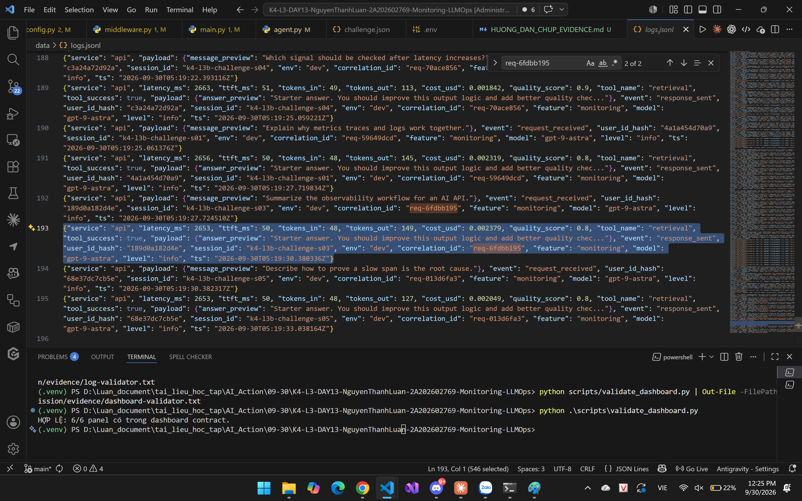
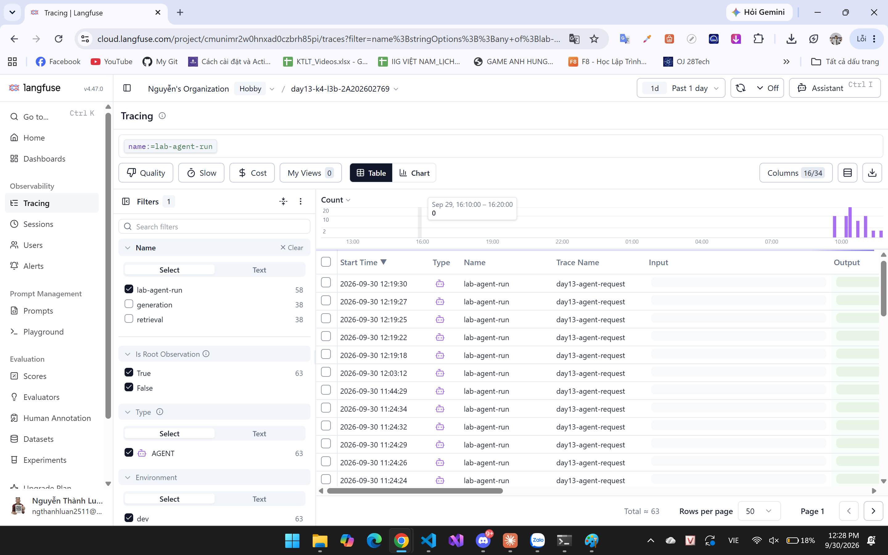
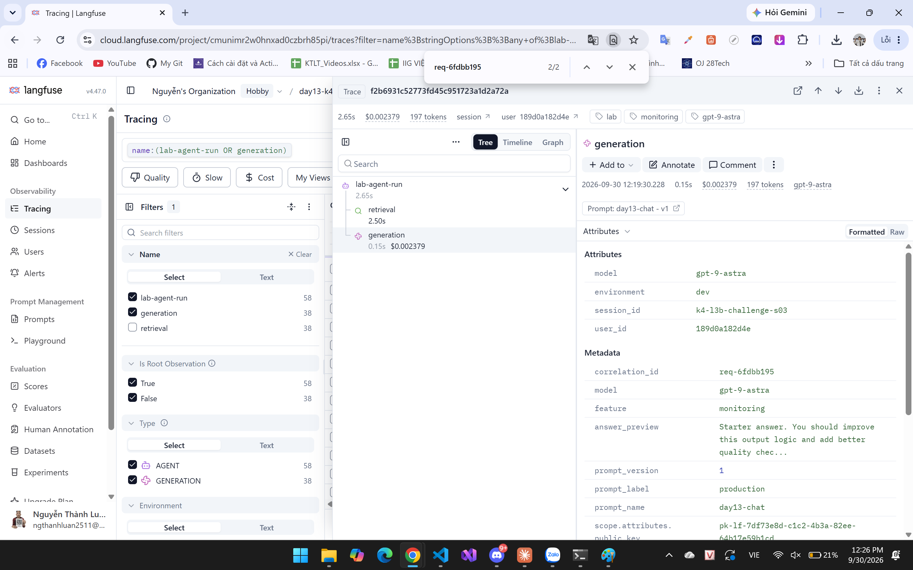
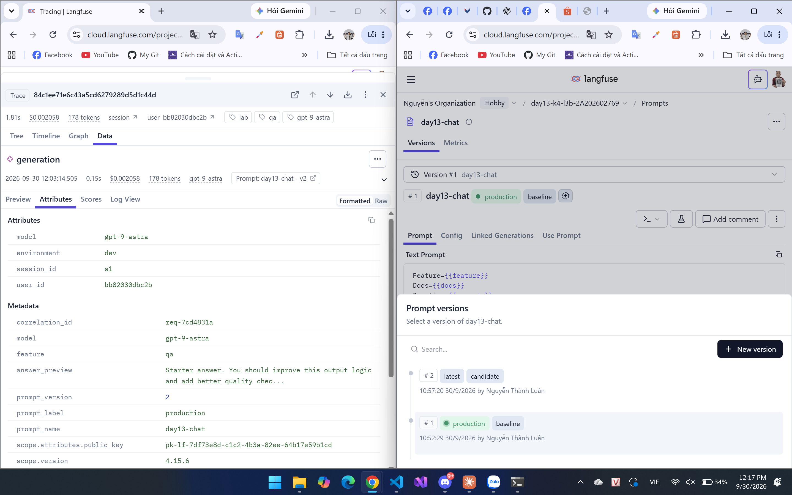
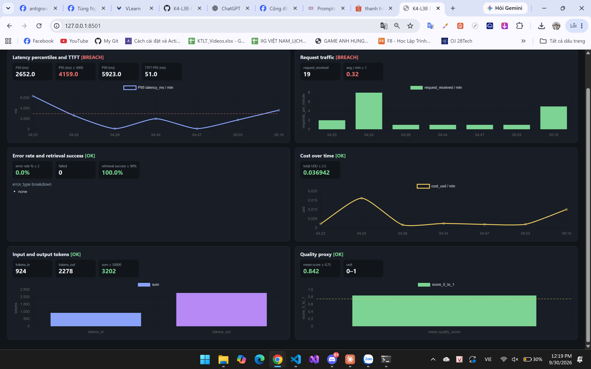

# Báo cáo cá nhân — K4-L3B Day 13 Monitoring & LLMOps

> Mỗi học viên hoàn thiện một file duy nhất này. Khi dẫn evidence, dùng đường dẫn tương đối, ví dụ `evidence/03-incident-trace.png`.

## 1. Thông tin học viên

- **Họ và tên:** Nguyễn Thành Luân
- **MSSV:** 2A202602769
- **Lớp:** K4-L3B
- **Repository URL:** https://github.com/Tluan-source/K4-L3-DAY13-NguyenThanhLuan-2A202602769-Monitoring-LLMOps
- **Commit SHA cuối:** *(điền `git log -1 --format=%H` sau commit nộp)*
- **Challenge ID:** `day13-k4-l3b-monitoring-llmops-v1`
- **Tên project Langfuse cá nhân:** `day13-k4-l3b-2A202602769`

## 2. Evidence index

| Evidence | Đường dẫn |
|---|---|
| Pytest | `evidence/pytest.txt` |
| Log validator | `evidence/log-validator.txt` |
| Dashboard validator | `evidence/dashboard-validator.txt` |
| Incident log (kiêm structured log) | `evidence/01-incident-log.png` |
| Trace list ≥ 10 | `evidence/02-trace-list.png` |
| Incident trace (cùng ID với ảnh 01) | `evidence/03-incident-trace.png` |
| Prompt v2 production + rollback | `evidence/04-prompt-versioning.png` |
| Dashboard 6 panel sau challenge | `evidence/05-dashboard-incident.png` |











## 3. Kết quả kỹ thuật

| Nội dung | Baseline | Kết quả cuối | Nhận xét |
|---|---|---|---|
| `validate_logs.py` | TODO CP1, thiếu enrichment/PII | 100/100 | 0 missing fields, 0 PII leak |
| `validate_dashboard.py` | YAML 6 panel | 6/6 | Runtime `scripts/dashboard.py` đọc `data/logs.jsonl` |
| `pytest` | starter + TODO | 26 passed | Thêm test CCCD, thẻ, passport, địa chỉ VN |
| Số traces hợp lệ | 0 child span | **63** `lab-agent-run` trên project cá nhân | Mỗi request: AGENT + RETRIEVER + GENERATION |
| Số PII leak | chưa scrub | 0 | `log-validator.txt` + tests; không ảnh PII riêng |
| Latency P95 / TTFT P95 | chưa đo | sau challenge: P95 **4159 ms** (BREACH), TTFT P95 **51 ms** | Ảnh 05; TTFT ổn, P95 bị `rag_slow` |
| Retrieval success rate | chưa đo | **100%**, error rate 0% | Challenge làm chậm RAG, không fail tool |

## 4. Logging và PII

- **Cách tạo/nhận và truyền correlation ID:** `CorrelationIdMiddleware` gọi `clear_contextvars()` mỗi request, đọc header `x-request-id` nếu có, không thì sinh `req-` + 8 hex. Bind structlog contextvars và `request.state.correlation_id`. Response trả `x-request-id` và `x-response-time-ms`. Agent nhận ID qua `LabAgent.run(..., correlation_id=...)` rồi `propagate_attributes`.
- **Các metadata được ghi vào structured log:** Trước `request_received`, `bind_contextvars` gắn `user_id_hash` (SHA-256 cắt 12), `session_id`, `feature`, `model`, `env`. Event `response_sent` thêm `latency_ms`, `ttft_ms`, `tokens_in`, `tokens_out`, `cost_usd`, `quality_score`, `tool_name`, `tool_success`. Ảnh 01 (`req-6fdbb195`) đọc được các field này.
- **Cách bảo đảm PII được scrub trước khi ghi:** Processor `scrub_event` đứng sau `TimeStamper`, trước `JsonlFileProcessor` và `JSONRenderer`. `scrub_text` che email, SĐT VN, CCCD, thẻ, passport, keyword địa chỉ VN. `hash_user_id` thay user id thô. Capture Langfuse input/output tắt.
- **Cách kiểm chứng kết quả:** `python scripts/validate_logs.py` → 100/100, 0 PII leak (`evidence/log-validator.txt`). `pytest` gồm test email/SĐT/CCCD/thẻ.

## 5. Tracing và prompt versioning

- **Cách xác nhận traces do chính tôi tạo:** Project `day13-k4-l3b-2A202602769`. Ảnh 02 filter `name:=lab-agent-run`, Total ≈ 63. Workload từ máy này: `load_test.py`, `/chat`, `load_test.py --challenge`.
- **Cấu trúc root/retrieval/generation:** `@observe(name="lab-agent-run")`. Trong `run()`, `start_as_current_observation(as_type="retriever")` bọc `retrieve()`, `as_type="generation"` bọc `FakeLLM.generate()` kèm usage/cost. Ảnh 03: root 2.65s → retrieval 2.50s → generation 0.15s.
- **Cách nối trace với log:** Cùng `correlation_id=req-6fdbb195` trên ảnh 01 (`logs.jsonl`) và metadata ảnh 03 (session `k4-l3b-challenge-s03`).
- **Prompt name:** `day13-chat`
- **Version/label baseline:** v1 / `baseline` (và `production` sau rollback)
- **Version/label candidate:** v2 / `candidate`
- **Trace ID chứng minh trên ảnh 04:**
  - Production trỏ **v2:** Trace `84c1ee71e6c43a5cd6279289d5d1c44d`, `correlation_id=req-7cd4831a`, UI `Prompt: day13-chat - v2`, metadata `prompt_version=2`, `prompt_label=production`, 178 tokens
  - Sau rollback: cùng tấm ảnh, phải, `#1` mang `production` + `baseline`, `#2` mang `candidate`
- **Cách promote và rollback:** Kéo label `production` v1 → v2, `.env` `LANGFUSE_PROMPT_LABEL=production`, restart API, gửi `/chat`. Kéo `production` về `#1`. App resolve prompt theo label, không hard-code version.

## 6. Dashboard, SLO và alerts

- **Dashboard và sáu panel:** `python scripts/dashboard.py` → http://127.0.0.1:8501, nguồn `data/logs.jsonl`, cửa sổ 60 phút. Ảnh 05 đủ 6 panel:
  1. Latency P50/P95/P99 + TTFT P95, đường SLO 3000ms — P95 **4159** BREACH, P99 **5923**, TTFT **51**
  2. Traffic request/phút (cột 04:24 và 05:19)
  3. Error 0%, retrieval success 100%
  4. Cost USD
  5. tokens_in / tokens_out
  6. Quality mean **0.842** ≥ 0.75
- **SLO và lý do chọn:** `fast_successful_requests` = 99.5% request / 28 ngày có `response_sent` và `latency_ms <= 3000`. Ngưỡng 3000ms khớp panel và bắt P95 4159 khi challenge.
- **Cách tính error budget:** 100% − 99.5% = 0.5%. 10.000 request → tối đa 50 request trượt. Request 2653ms (ảnh 01) và P95 4159ms đã đốt budget; alert P95 5 phút phải kêu sớm hơn cửa sổ 28 ngày.
- **Ba alert và runbook:** `config/alert_rules.yaml` + `docs/alerts.md`
  1. `HighLatencyP95` warning 5m — P95 > 3000ms — Slack `#k4-l3b-alerts` — `docs/alerts.md#alert-1`
  2. `HighErrorRate` critical 5m — error rate > 2% — `#alert-2`
  3. `LowRetrievalSuccess` warning 5m — retrieval success < 90% — `#alert-3`  
  Owner `student-2A202602769`. Runbook: dashboard → log `correlation_id` → Langfuse span → disable incident / rollback prompt.

## 7. Điều tra challenge

- **Challenge ID:** `day13-k4-l3b-monitoring-llmops-v1` (cohort K4, feature `monitoring`, threshold 2000ms)
- **Khoảng thời gian điều tra:** 2026-09-30 **05:19:17Z – 05:19:33Z** (lần `load_test.py --challenge` khớp ảnh 05 cột 05:19 và trace 12:19 giờ máy). Cột 04:23–04:24 trên dashboard là lần inject trước đó, cùng triệu chứng P95.
- **Triệu chứng từ metrics (ảnh 05):** Latency **BREACH** — P95 4159ms, P99 5923ms, đường 3000ms bị vượt lúc 04:23 và 05:19. Error rate 0%, retrieval 100%, quality 0.842. Triệu chứng là **độ trễ**, không phải lỗi hay quality.
- **Log line và correlation ID (ảnh 01):** `event=response_sent`, `correlation_id=req-6fdbb195`, `latency_ms=2653`, `feature=monitoring`, `session_id=k4-l3b-challenge-s03`, `env=dev`, `model=gpt-9-astra`, `ts=2026-09-30T05:19:30.380336Z`. Vượt threshold 2000ms.
- **Trace ID và span (ảnh 03):** Trace `f2b6931c52773fd45c951723a1d2a72a` (Langfuse 12:19:30, search `req-6fdbb195`)
  - `lab-agent-run` **2.65s** (khớp log 2653ms)
  - **`retrieval` 2.50s** (~94% thời gian)
  - `generation` **0.15s**, `$0.002379`, 197 tokens, `Prompt: day13-chat - v1`
- **Root cause:** Retrieval bị inject chậm ~2.5s (`rag_slow`: sleep trước khi trả docs). Generation ~150ms nên không phải LLM/token.
- **Fix action:** `python scripts/inject_incident.py --disable` (`/incidents/rag_slow/disable`).
- **Preventive measure:** Alert `HighLatencyP95` 5 phút; runbook so sánh span retrieval vs generation; không promote prompt khi P95 đang BREACH.

Chuỗi evidence cùng một sự cố:

```text
Dashboard P95 4159 BREACH lúc 05:19 (ảnh 05)
    → log req-6fdbb195 latency_ms=2653 (ảnh 01)
    → trace f2b6931c52773fd45c951723a1d2a72a (ảnh 03)
    → span retrieval 2.50s
    → rag_slow sleep 2.5s
    → disable incident + alert P95
```

## 8. Giải thích và tự đánh giá

- **Một quyết định kỹ thuật quan trọng và lý do:** Instrument retrieval/generation bằng `start_as_current_observation` (SDK v4) trong `agent.py`. Child span tự nằm dưới `lab-agent-run`. Test mock không có API đó nên `getattr` + `nullcontext()`. Tắt capture input/output vì message có thể chứa PII.
- **Một lỗi/blocker đã gặp:** PowerShell `curl` thành `Invoke-WebRequest`; `challenge.json` BOM; prompt cache 60s khiến rollback vẫn ra v2; `Tee-Object` ghi UTF-16 làm `HỢP LỆ` thành `Hß╗óP Lß╗å`.
- **Cách tìm nguyên nhân và xử lý:** Đọc traceback BOM → UTF-8 không BOM + `utf-8-sig`. Rollback: đối chiếu `prompt_version` trên Langfuse. Validator: `PYTHONIOENCODING=utf-8` và `Out-File -Encoding utf8`.
- **Cách hiểu luồng Metrics → Logs → Traces:** Dashboard (ảnh 05) nói triệu chứng và thời điểm. Log (ảnh 01) nói request nào. Trace (ảnh 03) nói bước retrieval chậm.
- **Vai trò của prompt version, token/cost, SLO hoặc rollback:** App gọi prompt theo label `production`. Ảnh 04: trái v2+production, phải `#1` production sau rollback. SLO 99.5%/3000ms biến P95 4159 thành tín hiệu hành động.
- **Điều quan trọng nhất đã học:** Ba lớp cùng một `correlation_id`; child span mới chỉ đúng retrieval chậm.
- **Hạn chế:** Ảnh 03/04 còn dòng `scope.attributes.public_key` trên UI Langfuse (OTEL resource). Nên crop dòng `pk-lf-...` nếu coach soi secret. SHA commit nộp điền mục 1 sau khi push. Không commit `.env` và `config/challenge.json`.

## 9. Checklist trước khi nộp

- [x] Evidence khớp thực hành: ảnh 01–05 + 3 file txt theo `docs/SUBMISSION.md`.
- [x] Ảnh 01 và 03 cùng `req-6fdbb195`.
- [x] Incident: metric (05) → log (01) → trace retrieval 2.50s (03).
- [x] Traces thuộc project `day13-k4-l3b-2A202602769` (ảnh 02, 63 traces).
- [x] Repository chạy: `uvicorn app.main:app --reload --env-file .env`.
- [x] Không commit `.env`, PII thô, `config/challenge.json`.
- [ ] URL repo và commit SHA cuối đã nộp trên LMS/Codelabs *(tick sau khi push)*.
